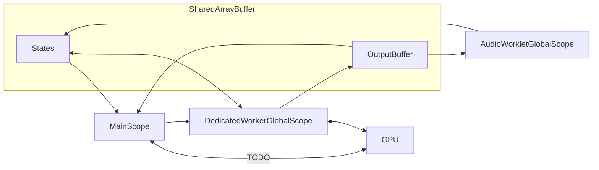

# <samp>webgpu-synth</samp>

## Architecture

```mermaid
flowchart LR
  subgraph SharedArrayBuffer
    States
    OutputBuffer
  end

  MainScope --> DedicatedWorkerGlobalScope
  States --> MainScope
  OutputBuffer --> MainScope
  MainScope <-- TODO --> GPU

  DedicatedWorkerGlobalScope --> OutputBuffer
  DedicatedWorkerGlobalScope <--> States
  DedicatedWorkerGlobalScope <--> GPU

  AudioWorkletGlobalScope --> States
  OutputBuffer --> AudioWorkletGlobalScope
```
